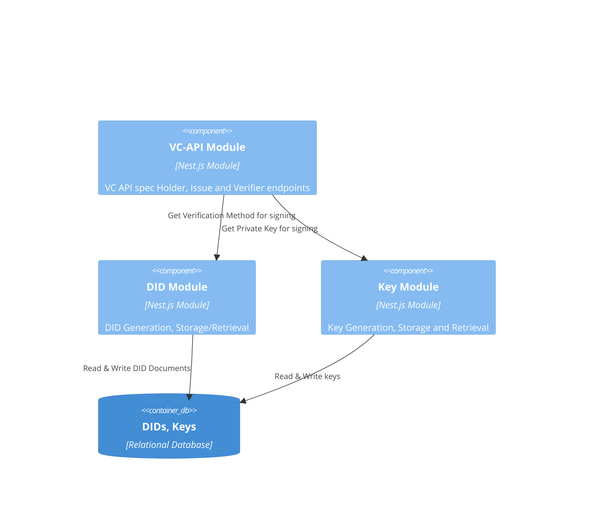

# NestJs VC-API

## Description

This [vc-api app](./) is a NestJs implementation of the [W3C Credentials Community Group](https://w3c-ccg.github.io/) [VC API Specification](https://w3c-ccg.github.io/vc-api).
[Nest](https://github.com/nestjs/nest) is a Typescript framework for server-side applications.

## Tutorials

See [tutorials](./docs/tutorials/).

## Architecture

The following is a [C4 Component diagram](https://c4model.com/#ComponentDiagram) of key functional modules of the VC-API implementation.



## Credential Exchanges

Credential exchanges are the processes by which credentials are moved between wallet/agent and issuer/verifer.
For more information on these processes, see the [exchanges documentation](./docs/exchanges.md). 

## Credential JSON-LD Contexts

The Verifiable Credentials specification uses contexts to ensure that the meanings of terms in a credential are shared by all parties.
For more information about this, see the [context documentation](./docs/contexts.md).

## Installation

Install using the [rush commands](../../README.md#installation) described in the root README.

## Running the app

Alternatively to `npm`, `pnpm` can be used for the commands below.

```bash
# development
$ npm run start

# watch mode
$ npm run start:dev

# production mode
$ npm run start:prod
```
### Swagger/OpenAPI

After starting the `vc-api` app, 
the Swagger/OpenAPI test page can be see at `{appURL}/api` (`http://localhost:3000/api` if running locally)

## Test

Alternatively to `npm`, `pnpm` can be used for the commands below.

```bash
# unit tests
$ npm run test:unit

# e2e tests
$ npm run test:e2e

# test coverage
$ npm run test:cov
```

### VC-API Module
An implementation of the [W3C Credentials Community Group](https://w3c-ccg.github.io/) [VC API Specification](https://w3c-ccg.github.io/universal-wallet-interop-spec/).
This spec provides a data model and HTTP protocols to issue, verify, present, and exchange verifiable credentials on the Web.
The [W3C Credentials Community Group](https://w3c-ccg.github.io/) also publishes [use cases for VC API](https://w3c-ccg.github.io/vc-api-use-cases/index.html).

#### Implemented Endpoints

| Profile | Endpoint | Implemented | Spec Link
| --- | --- | --- | --- |
| Issuing | Issue Credential | Yes | https://w3c-ccg.github.io/vc-api/#issue-credential
| Issuing | Get Credentials | No | https://w3c-ccg.github.io/vc-api/#get-credentials
| Issuing | Get a Specific Credential | No | https://w3c-ccg.github.io/vc-api/#get-a-specific-credential
| Issuing | Update Status | No | https://w3c-ccg.github.io/vc-api/#update-status
| Verifying | Verify Credential | Yes | https://w3c-ccg.github.io/vc-api/#verify-credential
| Verifying | Verify Presentation | Yes | https://w3c-ccg.github.io/vc-api/#verify-presentation
| Presenting | Derive Credential | No | https://w3c-ccg.github.io/vc-api/#derive-credential
| Presenting | Prove Presentation | Yes | https://w3c-ccg.github.io/vc-api/#prove-presentation
| Presenting | Exchange Discovery | No | https://w3c-ccg.github.io/vc-api/#exchange-discovery
| Presenting | Get Presentations | No | https://w3c-ccg.github.io/vc-api/#get-presentations
| Presenting | Get a Specific Presentation | No | https://w3c-ccg.github.io/vc-api/#get-a-specific-presentation
| Presenting | Initiate Exchange | Yes | https://w3c-ccg.github.io/vc-api/#initiate-exchange
| Presenting | Continue Exchange | Yes | https://w3c-ccg.github.io/vc-api/#continue-exchange

#### Standard vs Custom Endpoints

Not all of the endpoints available from this VC-API app are standard.
In particular, there are several endpoints related to exchanges that are outside of the specification.

| Profile | Endpoint | Standard | Spec Link
| --- | --- | --- | --- |
| Issuing | Issue Credential | Yes | https://w3c-ccg.github.io/vc-api/#issue-credential
| Verifying | Verify Credential | Yes | https://w3c-ccg.github.io/vc-api/#verify-credential
| Verifying | Verify Presentation | Yes | https://w3c-ccg.github.io/vc-api/#verify-presentation
| Presenting | Prove Presentation | Yes | https://w3c-ccg.github.io/vc-api/#prove-presentation
| Presenting | Initiate Exchange | Yes | https://w3c-ccg.github.io/vc-api/#initiate-exchange
| Presenting | Continue Exchange | Yes | https://w3c-ccg.github.io/vc-api/#continue-exchange
| Presenting | Configure Exchange | No | 
| Presenting | Query Submissions | No |  
| Presenting | Submit Submission Review | No |
| Presenting | Create Presentation from Credentials | No |

#### Supported Proof Types for Proof Generation

The proof types supported during Proof generation (e.g. issuance and presentation) are listed below.
Currently only [Data Integrity (JSON-LD)](https://www.w3.org/TR/vc-data-model/#data-integrity-proofs) proofs are supported.
The "Related DID" is mentioned because the verification method used to generate the proof is selected from the `issuer` property for VCs or `holder` property for VPs.

The following proof types are supported:

| Proof Type | Related DID | Test Status
| --- | --- | ---
| Ed25519Signature2018 | did:key | Covered by automated tests
| EcdsaSecp256k1Signature2019 | did:ethr | Not yet covered by automated tests

### DID Module

The DID Module in the [vc-api](./) offers the generation of DIDs and tracking the data resolvable in their DID documents.

#### Supported DID Methods

The table below shows which DID methods are available.

| DID Method | Notes
| --- | --- 
| key | Only Ed25519 (with `Ed25519VerificationKey2018` verification method)
| ethr | Only implicit DID resolution. No chain data resolution supported

### Key Module
The key module is kept separate from the DID module because it's plausible that key module will be provided by a different service (i.e. a dedicated KMS) at some point.

#### Supported Key Types

The table below shows which key types are available for each operation.

| Operations | Key Type 
| --- | --- 
| Import | Ed25519
| Generate | Ed25519, ES256K
| Export | Any key stored

#### Key Import/Export

The key module allows for the import and export of key pairs.
A tutorial demonstrating this available here: [Key Export/Import Tutorial](./docs/tutorials/key-export-import-tutorial.md)

## Database
SQLite is used as the database engine.
See [ADR-003](./docs/architecture/decisions/0003-use-sqlite-for-credo-db.md) for rationale details.
Databases can be found at the `~/.vc-api`, by default.

## License

This project is licensed under the GNU General Public License v3.0 or later - see the [LICENSE](LICENSE) file for details
NestJs is [MIT licensed](LICENSE).
