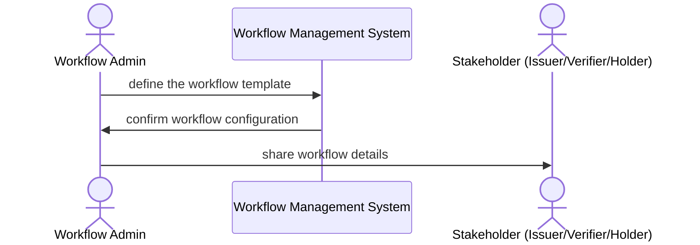
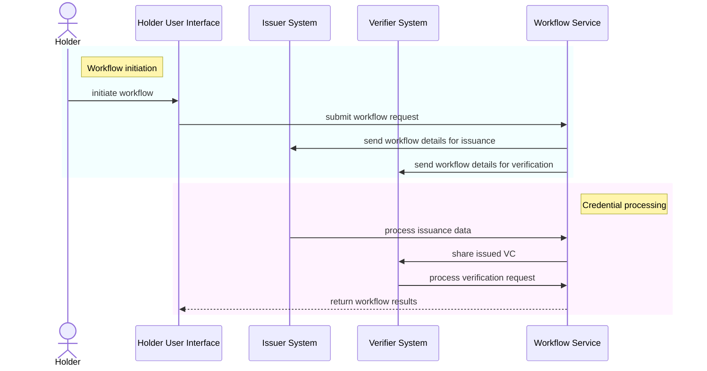

<!--
 Copyright 2021 - 2024 Energy Web Foundation
 
 This program is free software: you can redistribute it and/or modify
 it under the terms of the GNU General Public License as published by
 the Free Software Foundation, either version 3 of the License, or
 (at your option) any later version.
 
 This program is distributed in the hope that it will be useful,
 but WITHOUT ANY WARRANTY; without even the implied warranty of
 MERCHANTABILITY or FITNESS FOR A PARTICULAR PURPOSE.  See the
 GNU General Public License for more details.
 
 You should have received a copy of the GNU General Public License
 along with this program.  If not, see <http://www.gnu.org/licenses/>.
-->

# VC-API Workflows

## Overview of Workflows

This document defines workflows as a sequence of steps enabling interactions between parties (e.g., Holder, Issuer, Verifier) for Verifiable Credential (VC) issuance or verification processes. These workflows follow the guidelines established in [VC-API Workflows and Exchanges](https://w3c-ccg.github.io/vc-api/#workflows-and-exchanges).

Workflows allow developers to integrate and automate credential-related processes while maintaining compliance with standards like [DID](https://www.w3.org/TR/did-core/) and [VC Data Model](https://www.w3.org/TR/vc-data-model/).

---

## Credential Workflow Flows

### Workflow Configuration

### Workflow Execution: Issuance/Verification
This sequence diagram illustrates the execution of a credential issuance or verification workflow. It includes all major interactions required for a successful VC operation.

## Workflow Definitions

To maintain a generic implementation for the VC-API, workflows are configured dynamically at runtime using Workflow Definitions. These definitions specify the steps, rules, and entities involved in the workflow.

### Workflow Definition Structure and Properties

#### Workflow Steps

The steps property of a Workflow Definition specifies the sequence of actions to be performed.

Supported step types include:

- Issuance Initiation: Collects data from the Holder to initiate credential issuance.
- Verification Request: Sends VC data for verification.
- Credential Review: Allows stakeholders to review and approve VC data.
- Credential Storage: Saves the VC in a Holder's wallet or storage.

#### Workflow Callbacks
Workflow Definitions can include callbacks to notify parties when specific events occur during the workflow. Callbacks consist of POST requests to the configured URLs.

Example scenarios for callbacks:

- Notification to Issuer upon successful credential issuance.
- Notification to Verifier upon completion of a verification process.

#### Workflow Interaction Types

Workflow interaction types are derived from the Interaction Types specification.

- Mediated Workflows: Include human or automated review steps for issuance or verification.
- Unmediated Workflows: Automatically process all interactions without external mediation.

## Workflow Examples

### Issuance Workflow Example

A mediated issuance workflow involves interactions between the Holder, Workflow Service, and Issuer. The Workflow Service coordinates the collection of Holder data, submission to the Issuer, and issuance of the VC.

Example Workflow Steps:

- Holder initiates issuance request via UI.
- Workflow collects Holder details (e.g., DID, attributes).
- Issuer validates data and issues VC.
- Workflow stores the VC in the Holder’s wallet.

### Verification Workflow Example

An unmediated verification workflow involves direct submission of VC data to the Verifier.

Example Workflow Steps:

- Holder shares VC with Verifier.
- Workflow validates VC signatures and compliance.
- Workflow returns verification result to the Holder.
